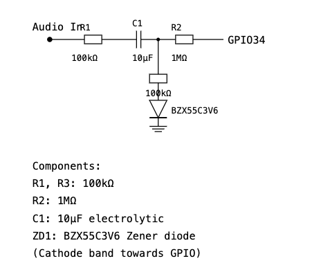

# Generate Sample MP3

A Python utility for creating test stereo MP3 files, specifically designed for testing audio input functionality on ESP32 devices.

## Overview

This tool generates stereo MP3 test files with specific patterns of sine waves and silence. These files are useful for:

- Testing stereo audio input circuits
- Validating left/right channel separation
- Calibrating audio volume levels
- Testing ESP32 audio sampling capabilities

## Generated Files

All output files are created in the `out/` directory:

### stereo_test.mp3

A 30-second test file with the following pattern:

1. 1 second silence
2. 1 second 440Hz sine wave on left channel only
3. 1 second 440Hz sine wave on right channel only
4. Pattern repeats for 30 seconds total

### stereo_volume_x.mp3

Multiple files with different volume levels:

- Same pattern as stereo_test.mp3
- Volume levels adjusted for calibration purposes
- Useful for testing input sensitivity

## Circuit Diagram

The following diagram shows the recommended audio input circuit for ESP32 testing:



This circuit follows JIS (Japanese Industrial Standards) schematic conventions and provides:

- Proper audio level adjustment
- DC bias for ESP32 ADC input
- Channel isolation for stereo testing

## Setup and Installation

This project uses:

- [mise](https://github.com/jdx/mise) for runtime management
- [rye](https://rye-up.com/) for Python dependency management

### Prerequisites

- Python 3.8 or higher
- mise installed on your system
- rye installed on your system

### Installation Steps

```shell
# Install required runtime versions
$ mise install

# Install Python dependencies
$ rye sync

# Generate test files
$ rye run dev     # Generate standard test file
# or
$ rye run vol     # Generate volume calibration files
```

## Technical Details

Output Format: MP3 stereo
Sample Rate: 44.1kHz
Test Tone: 440Hz (A4 note)
Bit Rate: 192kbps
Channel Separation: Complete isolation between L/R channels

## Common Use Cases

ESP32 ADC Testing

Verify ADC sampling accuracy
Test stereo channel separation
Calibrate input sensitivity

## Audio Circuit Validation

Test frequency response
Verify stereo isolation
Check volume levels

## Development Testing

Quick audio input verification
Volume calibration
Channel identification

## Project Structure

```bash
generate-sample-mp3/
├── src/
│   └── generator.py        # Main generation script
├── out/                    # Generated MP3 files
├── docs/
│   └── img/
│       └── audio_input.png # Circuit diagram
├── pyproject.toml         # Project dependencies
└── README.md
```
